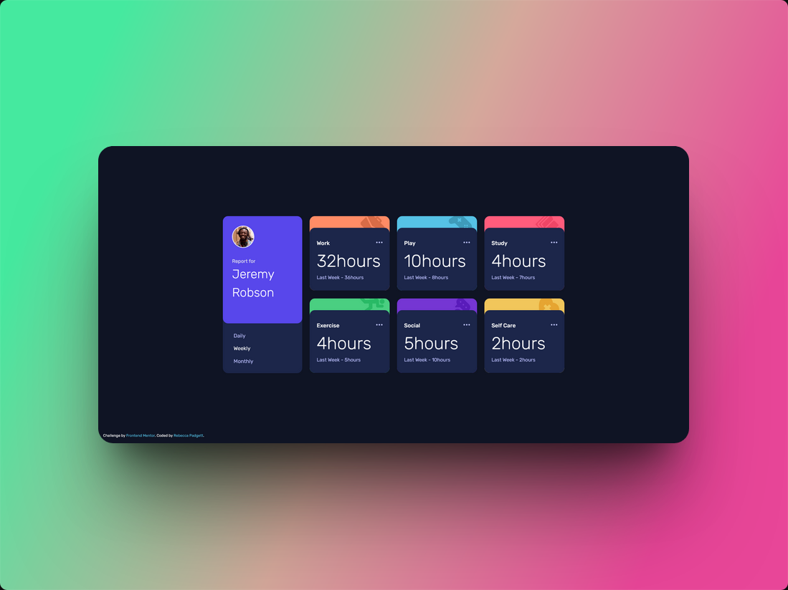

# Frontend Mentor - Time tracking dashboard solution

This is a solution to the [Time tracking dashboard challenge on Frontend Mentor](https://www.frontendmentor.io/challenges/time-tracking-dashboard-UIQ7167Jw). Frontend Mentor challenges help you improve your coding skills by building realistic projects. 

## Table of contents

- [Overview](#overview)
  - [The challenge](#the-challenge)
  - [Screenshot](#screenshot)
  - [Links](#links)
- [My process](#my-process)
  - [Built with](#built-with)
  - [What I learned](#what-i-learned)
  - [Continued development](#continued-development)
  - [Useful resources](#useful-resources)
- [Author](#author)
- [Acknowledgments](#acknowledgments)


## Overview

### The challenge

Users should be able to:

- View the optimal layout for the site depending on their device's screen size
- See hover states for all interactive elements on the page
- Switch between viewing Daily, Weekly, and Monthly stats

### Screenshot




### Links

- Solution URL: [Frontend Mentor]()
- Live Site URL: [GitHub Pages]()

## My process

### Built with

<p align="left">
  
  
  
</p>


### What I learned

In this project, I learned how to fecth data from json file and populate the cards dynamically for multiple timeframes.


```js
fetch('./data.json')
.then((response) => {
  if (!response.ok) {
     throw new Error(`HTTP error! Status: ${response.status}`);
  }
  return response.json();
})
.then((data) => {
  console.log(data);
})
.catch((error) => {
   console.error(`Error fetching data: ${error}`)
});

```

### Continued development

Add animations in future projects.


### Useful resources
- [Using CSS Properties](https://www.youtube.com/watch?v=_2LwjfYc1x8) - Local scoped CSS properties can be useful for reusability
- [Shots](https://shots.so/) - Create and share beautiful screenshots of your site


## Author 👩‍💻
- [Rebecca Padgett](https://linkedin.com/in/rebeccapadgett121) on LinkedIn


## Acknowledgments
This great [Time Tracking Dashboard solution](https://www.frontendmentor.io/solutions/-time-tracking-dashboard-kTWhQsgd6e) is the reason why I completed this challenge. 


